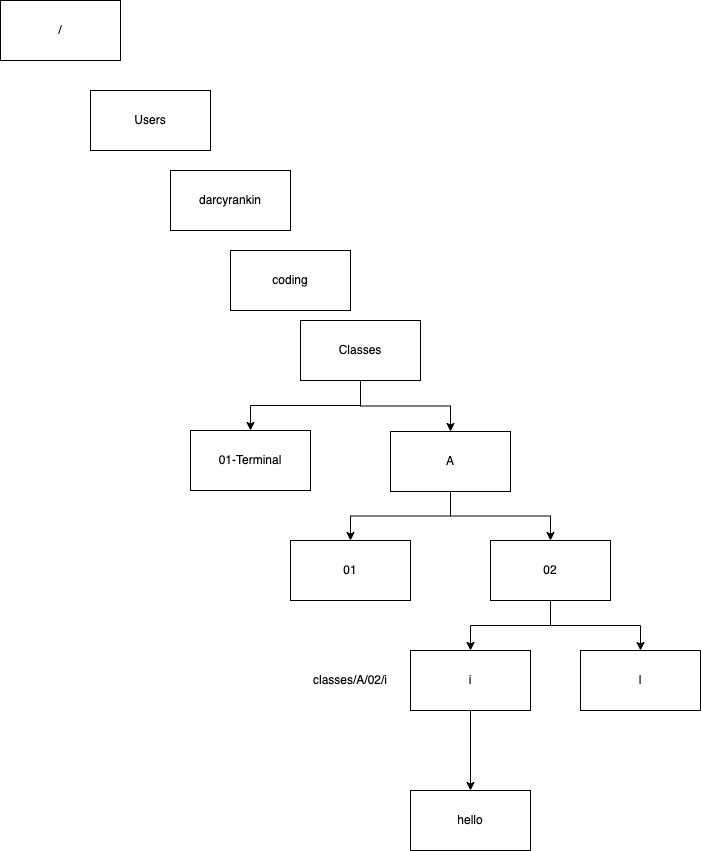

# Terminal / Bash Commands

## List Files/Directories

Simple list
`ls`

Expanded List
`ls -l` 

With sizes that are human readeable
`ls -lh`

All
`ls -la`

## Directories

To go to a child directory...
``
cd <dir_name>
``

To return back to parent
``
cd ..
``

To create a dir
``
mkdir <dir_name>
``

To delete a file
``
rm <file_name/wildcard>
``

To delete a dir
``
rm -r <dir_name/wildcard>
``

To find where you are
``
pwd
``

To Move/Rename a File or Dir
``
mv <file_name> <destination>
``

To copy a File
``
cp <file_name> <destination>
``

To create empty file
``
touch <file_name>
``

## Clean Screen
`clear`

# Exercise 

1) Create an empty file under ``01-Terminal`` named `foo` and move it under `l` 
directory

# Homework
1) Create a file Named `xyz` under `01-Terminal` and:
    a) Create a folder `Z` under `l`
    b) Move `xyz` under `Z`
    c) Move `Z` dir under `A`

2) Create a file Named `RRR` under `02` and:
   a) Rename `RRR` to `rrr`

3) Delete all files and directories created in (1) and (2):
   - `xyz` file
   - `Z` dir
   - `rrr` file